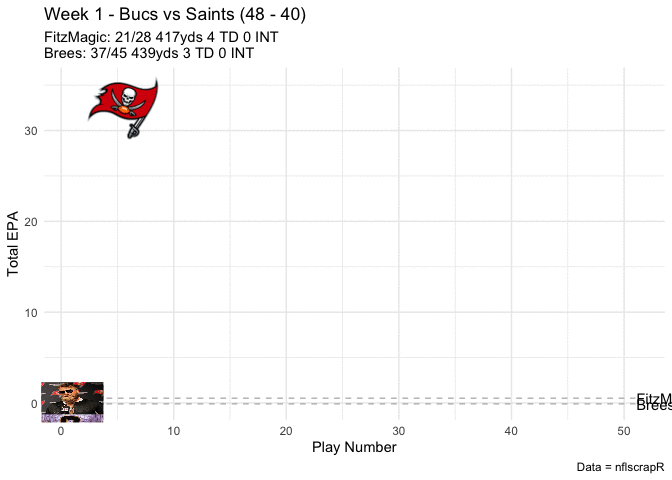

Animated QB EPA Game Visual
================
Jason Lee, Sr. Data Scientist - A.I. Sports

## Load libraries

``` r
library("tidyverse")
```

    ## ── Attaching packages ────────────────────────────────────────────────────────────────────────── tidyverse 1.3.0 ──

    ## ✓ ggplot2 3.3.2     ✓ purrr   0.3.4
    ## ✓ tibble  3.0.3     ✓ dplyr   1.0.0
    ## ✓ tidyr   1.1.0     ✓ stringr 1.4.0
    ## ✓ readr   1.3.1     ✓ forcats 0.5.0

    ## ── Conflicts ───────────────────────────────────────────────────────────────────────────── tidyverse_conflicts() ──
    ## x dplyr::filter() masks stats::filter()
    ## x dplyr::lag()    masks stats::lag()

``` r
library("dplyr")
library("ggimage")
library("teamcolors")
library("gganimate")
library("RCurl")
```

    ## 
    ## Attaching package: 'RCurl'

    ## The following object is masked from 'package:tidyr':
    ## 
    ##     complete

``` r
library("png")
library("grid")
```

## Relive Birth of FitzMagic

Week 1 2018 vs Drew Brees

``` r
## Load data
play_by_play2018 <- read_csv(url("https://github.com/ryurko/nflscrapR-data/raw/master/play_by_play_data/regular_season/reg_pbp_2018.csv"))
```

    ## Parsed with column specification:
    ## cols(
    ##   .default = col_double(),
    ##   home_team = col_character(),
    ##   away_team = col_character(),
    ##   posteam = col_character(),
    ##   posteam_type = col_character(),
    ##   defteam = col_character(),
    ##   side_of_field = col_character(),
    ##   game_date = col_date(format = ""),
    ##   game_half = col_character(),
    ##   time = col_time(format = ""),
    ##   yrdln = col_character(),
    ##   desc = col_character(),
    ##   play_type = col_character(),
    ##   pass_length = col_character(),
    ##   pass_location = col_character(),
    ##   run_location = col_character(),
    ##   run_gap = col_character(),
    ##   field_goal_result = col_character(),
    ##   extra_point_result = col_character(),
    ##   two_point_conv_result = col_character(),
    ##   timeout_team = col_character()
    ##   # ... with 88 more columns
    ## )

    ## See spec(...) for full column specifications.

    ## Warning: 132 parsing failures.
    ##  row                           col           expected       actual         file
    ## 1715 blocked_player_id             1/0/T/F/TRUE/FALSE 00-0033886   <connection>
    ## 1715 blocked_player_name           1/0/T/F/TRUE/FALSE T.Watt       <connection>
    ## 1854 fumble_recovery_2_team        1/0/T/F/TRUE/FALSE KC           <connection>
    ## 1854 fumble_recovery_2_player_id   1/0/T/F/TRUE/FALSE 00-0030615   <connection>
    ## 1854 fumble_recovery_2_player_name 1/0/T/F/TRUE/FALSE J.Winchester <connection>
    ## .... ............................. .................. ............ ............
    ## See problems(...) for more details.

### Filter to Game 1

``` r
## filter to specific game
game1 <- play_by_play2018 %>%
  filter(game_id == "2018090906")
```

### FitzMagic’s Plays

``` r
## Fitz Plays
FitzMagic <- game1 %>%
  filter(str_detect(desc, "Fitz")) %>%
  filter(!is.na(epa)) %>%
  arrange(desc(game_seconds_remaining)) %>%
  select(epa, posteam) %>%
  mutate(Total_EPA = cumsum(epa),
         Play_Num = row_number(),
         QB = "FitzMagic",
         url = "https://raw.githubusercontent.com/papagorgio23/BuccaneeRstat/master/images/fitzmagic.png")
```

### Drew Brees’s Plays

``` r
## Brees Plays
Brees <- game1 %>%
  filter(str_detect(desc, "Brees")) %>%
  filter(!is.na(epa)) %>%
  arrange(desc(game_seconds_remaining)) %>%
  select(epa, posteam) %>%
  mutate(Total_EPA = cumsum(epa),
         Play_Num = row_number(),
         QB = "Brees",
         url = "https://raw.githubusercontent.com/papagorgio23/BuccaneeRstat/master/images/brees.png")
```

### Combine QBs’ Data

``` r
# combine qb datasets
BothQB <- rbind(FitzMagic, Brees)
```

### Get Logo

``` r
# get logo
logo_url <- "https://raw.githubusercontent.com/papagorgio23/BuccaneeRstat/master/images/Tampa.png"
logo <-  png::readPNG(getURLContent(logo_url))
rast <- grid::rasterGrob(logo, interpolate = T)
```

```` r
# ```{r, eval=FALSE}
# plot game
ggplot(BothQB, aes(Play_Num, Total_EPA, group = QB)) +
  geom_line(aes(color = QB, size = 2), show.legend = FALSE) +
  scale_color_manual(values = c("#9f8958", "#d50a0a")) +
  geom_segment(aes(xend = 51, yend = Total_EPA), linetype = 2, colour = 'grey') +
  geom_point(size = 2) +
  geom_image(aes(image = url), size = 0.1) +
  geom_text(aes(x = 51.1, label = QB), hjust = 0) +
  coord_cartesian(clip = 'off') +
  labs(title = 'Week 1 - Bucs vs Saints (48 - 40)',
       subtitle =  'FitzMagic: 21/28 417yds 4 TD 0 INT \nBrees: 37/45 439yds 3 TD 0 INT',
       y = 'Total EPA',
       x = 'Play Number',
       caption = "Data = nflscrapR") +
  transition_reveal(Play_Num) +
  theme_minimal() +
  annotation_custom(rast, xmin=1, xmax=10, ymin=29, ymax=36)
````

<!-- -->

``` r
anim_save("Week1 Fitz.gif", animation = last_animation())
```
