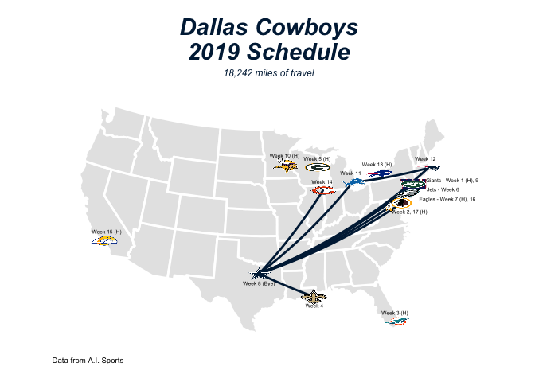

Map NFL Schedule
================

<br>

This is a tutorial to make a plot similar to our [BuccaneeRs
Twitter](https://twitter.com/buccaneeRstat/status/1161872734382632960)
map below:

<br>


<br>

``` r
library(tidyverse)
```

    ## ── Attaching packages ──────────────────────────────────────────────────────────── tidyverse 1.3.0 ──

    ## ✓ ggplot2 3.3.1     ✓ purrr   0.3.4
    ## ✓ tibble  3.0.1     ✓ dplyr   1.0.0
    ## ✓ tidyr   1.1.0     ✓ stringr 1.4.0
    ## ✓ readr   1.3.1     ✓ forcats 0.5.0

    ## ── Conflicts ─────────────────────────────────────────────────────────────── tidyverse_conflicts() ──
    ## x dplyr::filter() masks stats::filter()
    ## x dplyr::lag()    masks stats::lag()

``` r
library(ggimage)
library(ggthemes)
```

    ## Warning: package 'ggthemes' was built under R version 4.0.1

``` r
library(mapproj)
```

    ## Warning: package 'mapproj' was built under R version 4.0.1

    ## Loading required package: maps

    ## Warning: package 'maps' was built under R version 4.0.1

    ## 
    ## Attaching package: 'maps'

    ## The following object is masked from 'package:purrr':
    ## 
    ##     map

### Load Data

There are 2 different datasets we will be using.

1.  The Full 2019 season schedule
2.  A dataset with each team’s location and logo

<!-- end list -->

``` r
# load 2019 schedule
schedule <- read_csv("https://raw.githubusercontent.com/papagorgio23/BuccaneeRstat/master/data/nfl2019.csv")
# load nfl team data
team_info <- read_csv("https://raw.githubusercontent.com/papagorgio23/BuccaneeRstat/master/data/NFL_Team_Info.csv")
```

We can go ahead a view the schedule dataset. There are 15 columns total
and the entire 256 game matchups.

``` r
head(schedule)
```

    ## # A tibble: 6 x 15
    ##   type  game_id home_team away_team  week season state_of_game game_url
    ##   <chr>   <dbl> <chr>     <chr>     <dbl>  <dbl> <chr>         <chr>   
    ## 1 reg    2.02e9 CHI       GB            1   2019 PRE           http://…
    ## 2 reg    2.02e9 CAR       LA            1   2019 PRE           http://…
    ## 3 reg    2.02e9 PHI       WAS           1   2019 PRE           http://…
    ## 4 reg    2.02e9 NYJ       BUF           1   2019 PRE           http://…
    ## 5 reg    2.02e9 MIN       ATL           1   2019 PRE           http://…
    ## 6 reg    2.02e9 MIA       BAL           1   2019 PRE           http://…
    ## # … with 7 more variables: home_score <lgl>, away_score <lgl>,
    ## #   home_longitude <dbl>, home_latitude <dbl>, away_longitude <dbl>,
    ## #   away_latitude <dbl>, travel <dbl>

## Filter to your team:

``` r
# filter to dallas games
team_schedule <- schedule %>%
  filter(home_team == "DAL" | away_team == "DAL")
```

## Home team doesn’t travel

``` r
# change travel to 0 when we are at home
team_schedule$travel <- ifelse(team_schedule$home_team == "DAL", 0, team_schedule$travel)
```

## How far do we travel?

``` r
sum(team_schedule$travel)
```

    ## [1] 18242

``` r
library(maps)
us_states <- map_data("state")
```

``` r
teams <- unique(c(team_schedule$home_team, team_schedule$away_team))
```

``` r
# get just the needed logos for teams we play
team_info <- team_info %>%
  filter(team_code %in% teams)
```

``` r
### Dallas Cowboys:
ggplot() + 
  geom_polygon(data = us_states, 
               mapping = aes(x = long, 
                             y = lat, 
                             group = group, 
                             fill = region), 
               color = "white", 
               size = 1) + 
  scale_fill_manual(values = rep(c("grey90"), 49)) + 
  labs(title = "Dallas Cowboys\n2019 Schedule",
       subtitle = "18,242 miles of travel",
       caption = "Data from A.I. Sports") + 
  geom_path(data = team_schedule, aes(x = home_longitude, y = home_latitude), color = "#002244", size = 1) +
  geom_image(data = team_info, aes(x = longitude, y = latitude, image = url)) + 
  annotate("text", 
           x = team_schedule[team_schedule$week == 1, 'away_longitude'][[1]] + 5.7, 
           y = team_schedule[team_schedule$week == 1, 'away_latitude'][[1]] - 0.83, 
           label = "Giants - Week 1 (H), 9", 
           size = 1.75) +
  annotate("text", 
           x = team_schedule[team_schedule$week == 2, 'home_longitude'][[1]] + 1.3, 
           y = team_schedule[team_schedule$week == 2, 'home_latitude'][[1]] - 1, 
           label = "Week 2, 17 (H)", 
           size = 1.75) +
  annotate("text", 
           x = team_schedule[team_schedule$week == 3, 'away_longitude'][[1]], 
           y = team_schedule[team_schedule$week == 3, 'away_latitude'][[1]] + 1, 
           label = "Week 3 (H)", 
           size = 1.75) +
  annotate("text", 
           x = team_schedule[team_schedule$week == 4, 'home_longitude'][[1]], 
           y = team_schedule[team_schedule$week == 4, 'home_latitude'][[1]] - 1, 
           label = "Week 4", 
           size = 1.75) +
  annotate("text", 
           x = team_schedule[team_schedule$week == 5, 'away_longitude'][[1]], 
           y = team_schedule[team_schedule$week == 5, 'away_latitude'][[1]] + 1, 
           label = "Week 5 (H)", 
           size = 1.75) +
  annotate("text", 
           x = team_schedule[team_schedule$week == 6, 'home_longitude'][[1]] + 4, 
           y = team_schedule[team_schedule$week == 6, 'home_latitude'][[1]] - 1.5, 
           label = "Jets - Week 6", 
           size = 1.75) +
  annotate("text", 
           x = team_schedule[team_schedule$week == 7, 'away_longitude'][[1]] + 5.3, 
           y = team_schedule[team_schedule$week == 7, 'away_latitude'][[1]] - 1.75, 
           label = "Eagles - Week 7 (H), 16", 
           size = 1.75) +
  annotate("text", 
           x = team_info[team_info$team_code == "DAL", 'longitude'][[1]], 
           y = team_info[team_info$team_code == "DAL", 'latitude'][[1]] - 1.1, 
           label = "Week 8 (Bye)", 
           size = 1.75) +
  annotate("text", 
           x = team_schedule[team_schedule$week == 10, 'away_longitude'][[1]], 
           y = team_schedule[team_schedule$week == 10, 'away_latitude'][[1]] + 1.1, 
           label = "Week 10 (H)", 
           size = 1.75) +
  annotate("text", 
           x = team_schedule[team_schedule$week == 11, 'home_longitude'][[1]], 
           y = team_schedule[team_schedule$week == 11, 'home_latitude'][[1]] + 1.1, 
           label = "Week 11", 
           size = 1.75) +
  annotate("text", 
           x = team_schedule[team_schedule$week == 12, 'home_longitude'][[1]], 
           y = team_schedule[team_schedule$week == 12, 'home_latitude'][[1]] + 1.1, 
           label = "Week 12", 
           size = 1.75) +
  annotate("text", 
           x = team_schedule[team_schedule$week == 13, 'away_longitude'][[1]], 
           y = team_schedule[team_schedule$week == 13, 'away_latitude'][[1]] + 1.1, 
           label = "Week 13 (H)", 
           size = 1.75) +
  annotate("text", 
           x = team_schedule[team_schedule$week == 14, 'home_longitude'][[1]], 
           y = team_schedule[team_schedule$week == 14, 'home_latitude'][[1]] + 1, 
           label = "Week 14", 
           size = 1.75) +
  annotate("text", 
           x = team_schedule[team_schedule$week == 15, 'away_longitude'][[1]], 
           y = team_schedule[team_schedule$week == 15, 'away_latitude'][[1]] + 1.1, 
           label = "Week 15 (H)", 
           size = 1.75) +
  coord_map(projection = "albers", lat0 = 39, lat1 = 45) + 
  guides(fill = FALSE) + 
  theme_map() +
  theme(plot.title = element_text(hjust = 0.5, color="#002244", size=22, face="bold.italic"),
        plot.caption = element_text(hjust = 0.1),
        plot.subtitle = element_text(hjust = 0.5, color="#002244", face = "italic")) 
```

<!-- -->
