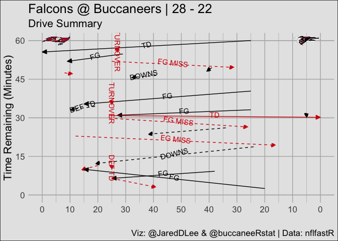
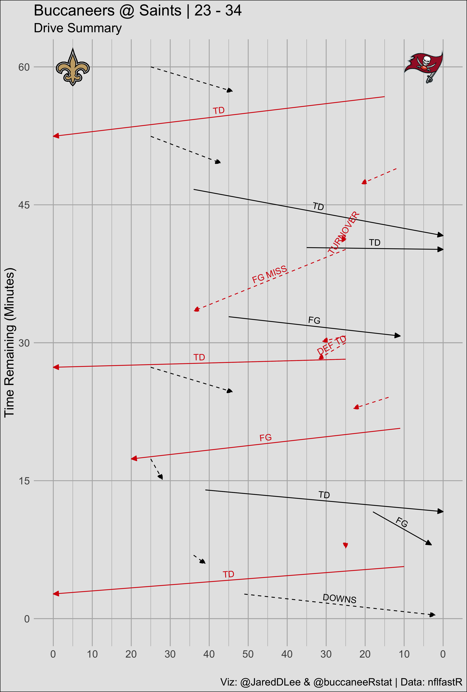

Post Game Analysis
================
Jason Lee, Sr. Data Scientist - A.I. Sports

## Load libraries

``` r
library(tidyverse)
```

    ## ── Attaching packages ────────────────────────────────────────────────────────────────────────────────────────────── tidyverse 1.3.0 ──

    ## ✓ ggplot2 3.3.2     ✓ purrr   0.3.4
    ## ✓ tibble  3.0.3     ✓ dplyr   1.0.2
    ## ✓ tidyr   1.1.2     ✓ stringr 1.4.0
    ## ✓ readr   1.3.1     ✓ forcats 0.5.0

    ## ── Conflicts ───────────────────────────────────────────────────────────────────────────────────────────────── tidyverse_conflicts() ──
    ## x dplyr::filter() masks stats::filter()
    ## x dplyr::lag()    masks stats::lag()

``` r
library(ggimage)
library(nflfastR)
```

## Function to Plot Drives

``` r
# Plot Function
plot_nfl_drive <- function(game_pbp,
                           asp = 8.1 / 12,
                           alt_color = "none") {
  match.arg(alt_color, c("none", "home", "away", "both"))

  away_team <- first(game_pbp$away_team)
  home_team <- first(game_pbp$home_team)
  away_points <- first(game_pbp$away_score)
  home_points <- first(game_pbp$home_score)

  drives <-  game_pbp %>%
    separate(drive_end_yard_line, into = c("end_side", "end_yd")) %>%
    separate(drive_start_yard_line, into = c("start_side", "start_yd")) %>%
    mutate(end_yd = as.numeric(end_yd), start_yd = as.numeric(start_yd)) %>%
    mutate(
      end_yd = ifelse(end_side == away_team, 100 - end_yd, end_yd),
      start_yd = ifelse(start_side == away_team, 100 - start_yd, start_yd)
    ) %>%
    group_by(drive) %>%
    summarize(
      offense = posteam[[1]],
      sec_start = first(game_seconds_remaining),
      sec_end = last(game_seconds_remaining),
      start_yardline = first(start_yd),
      end_yardline = first(end_yd),
      scoring = first(drive_ended_with_score) == 1,
      drive_result = first(fixed_drive_result),
      n = n()
    ) %>%
    mutate(angle = atan((sec_end - sec_start) / 3600 / (end_yardline - start_yardline) *
                          130
    ) * 180 / pi) %>%
    filter(!is.na(offense)) %>%
    mutate(
      drive_result = case_when(
        drive_result == "Punt" ~ "PUNT",
        drive_result == "Turnover on downs" ~ "DOWNS",
        drive_result == "Field goal" ~ "FG",
        drive_result == "Touchdown" ~ "TD",
        drive_result == "Turnover" ~ "TURNOVER",
        drive_result == "Safety" ~ "SAFETY",
        drive_result == "Opp touchdown" ~ "DEF TD",
        drive_result == "Missed field goal" ~ "FG MISS",
        TRUE ~ drive_result
      ),
      end_yardline = ifelse(
        drive_result == "TD",
        ifelse(offense == away_team, 0, 100),
        end_yardline
      )
    )

  home_info <-
    nflfastR::teams_colors_logos[nflfastR::teams_colors_logos$team_abbr == home_team, ]
  away_info <-
    nflfastR::teams_colors_logos[nflfastR::teams_colors_logos$team_abbr == away_team, ]
  title <-
    paste0(away_info$team_nick,
           " @ ",
           home_info$team_nick,
           " | ",
           away_points,
           " - ",
           home_points)
  images <- bind_rows(home_info, away_info) %>%
    mutate(
      logo = team_logo_espn,
      x = ifelse(team_abbr == home_info$team_abbr, 5, 95),
      y = 60 * 60
    )
  if (alt_color == "none") {
    home_color <- home_info$team_color
    away_color <- away_info$team_color
  } else if (alt_color == "home") {
    home_color <- home_info$team_color2
    away_color <- away_info$team_color
  } else if (alt_color == "away") {
    home_color <- home_info$team_color
    away_color <- away_info$team_color2
  } else if (alt_color == "both") {
    home_color <- home_info$team_color2
    away_color <- away_info$team_color2
  }
  names(home_color) <- home_info$team_abbr
  names(away_color) <- away_info$team_abbr
  colors <- c(home_color, away_color)

  drives %>%
    ggplot(
      aes(
        y = sec_start,
        yend = sec_end,
        x = start_yardline,
        xend = end_yardline,
        color = offense
      )
    ) +
    geom_hline(yintercept = seq(0, 3600, 1800), color = "gray70") +
    ggimage::geom_image(
      data = images,
      aes(x = x, y = y, image = logo),
      inherit.aes = FALSE,
      size = .10,
      alpha = .7,
      asp = asp
    ) +
    geom_segment(aes(linetype = scoring),
                 arrow = arrow(
                   angle = 25,
                   length = unit(.1, "in"),
                   type = "closed"
                 )) +
    geom_text(
      data = drives %>%
        filter(!(
          drive_result %in% c("PUNT", "Uncategorized") |
            str_detect(drive_result, "End")
        )),
      aes(
        x = (start_yardline + end_yardline) / 2,
        y = (sec_end + sec_start) / 2,
        label = drive_result,
        angle = angle
      ),
      nudge_y = 40,
      show.legend = FALSE
    ) +
    scale_linetype_manual(values = c(2, 1), breaks = NULL) +
    scale_color_manual(values = c(home_color, away_color)) +
    scale_y_continuous(
      breaks = seq(0, 3600, 900),
      labels = function(x) {
        x / 60
      }
    ) +
    scale_x_continuous(
      breaks = seq(0, 100, 10),
      minor_breaks = seq(5, 95, 10),
      labels = function(x) {
        -abs(x - 50) + 50
      },
      limits = c(0, 100)
    ) +
    labs(
      y = "Time Remaining (Minutes)",
      x = "",
      title = title,
      subtitle = "Drive Summary",
      caption = "Viz: @JaredDLee & @buccaneeRstat | Data: nflfastR"
    ) +
    theme_minimal() +
    theme(
      #panel.grid.major.y = element_blank(),
      text = element_text(size = 16),
      panel.grid = element_line(color = "gray70"),
      panel.grid.minor.y = element_blank(),
      #panel.grid.minor.x = element_blank(),
      legend.title = element_blank(),
      legend.position = "none",
      plot.background = element_rect(fill = "gray90")
    )
}
```

## Get Play-by-Play Data

``` r
game_pbp <- nflfastR::fast_scraper("2019_17_ATL_TB")
```

    ## Download finished. Adding variables...

    ## added game variables

    ## added nflscrapR variables

    ## added ep variables

    ## added air_yac_ep variables

    ## added wp variables

    ## added air_yac_wp variables

    ## added cp and cpoe

    ## added fixed drive variables

    ## added series variables

    ## Procedure completed.

## Plot and Save Chart

``` r
plot_nfl_drive(game_pbp, alt_color = "away")
```

    ## `summarise()` ungrouping output (override with `.groups` argument)

<!-- -->

## Resize and Save Plot

As you can see the above plot is not sized properly. We will fix that
when saving the output.

``` r
ggsave(
  "Post Game Analysis/images/week17.png",
  width = 8.1,
  height = 12,
  units = "in",
  dpi = "retina"
)
```

``` r

```


